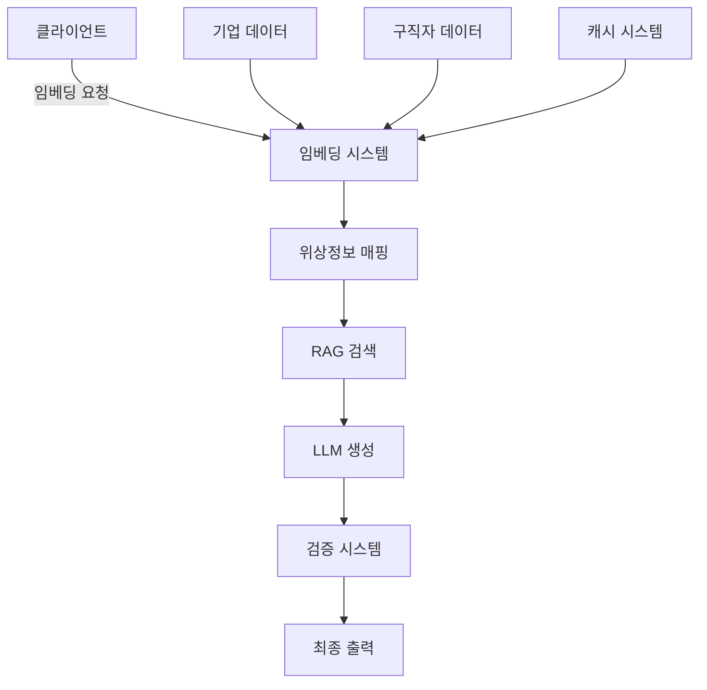

# 잡코리아 AI Challenge - LLM Engineer 작업 명세서

## 📋 프로젝트 개요

### 목표
채용공고 자동생성 GenAI 서비스의 할루시네이션 문제와 응답 지연 문제를 해결하는 위상정보 기반 매칭 시스템 구현

### 핵심 해결 방안
- **위상정보 시스템**: 기업-구직자 간 관계성 기반 매칭
- **가중치 기반 임베딩**: 정량적 지표를 활용한 객관적 매칭
- **하이브리드 임베딩**: 클라이언트-서버 분산 처리
- **RAG + 위상경계**: 환각 현상 원천 차단

## 🏗️ 시스템 아키텍처



## 📁 프로젝트 구조

```
jobkorea-ai-challenge/
├── README.md
├── requirements.txt
├── config/
│   ├── settings.py
│   └── prompts.yaml
├── data/
│   ├── companies/
│   ├── job_seekers/
│   └── embeddings/
├── src/
│   ├── __init__.py
│   ├── embeddings/
│   │   ├── __init__.py
│   │   ├── base_embedder.py
│   │   ├── company_embedder.py
│   │   └── candidate_embedder.py
│   ├── topology/
│   │   ├── __init__.py
│   │   ├── topology_mapper.py
│   │   ├── gravity_field.py
│   │   └── boundary_validator.py
│   ├── matching/
│   │   ├── __init__.py
│   │   ├── weighted_matcher.py
│   │   └── bidirectional_optimizer.py
│   ├── rag/
│   │   ├── __init__.py
│   │   ├── vector_store.py
│   │   └── retriever.py
│   ├── generation/
│   │   ├── __init__.py
│   │   ├── llm_generator.py
│   │   └── hallucination_guard.py
│   ├── validation/
│   │   ├── __init__.py
│   │   ├── fact_checker.py
│   │   └── consistency_validator.py
│   └── api/
│       ├── __init__.py
│       ├── server.py
│       └── client_handler.py
├── tests/
│   ├── test_embeddings.py
│   ├── test_topology.py
│   └── test_generation.py
├── notebooks/
│   ├── 01_data_exploration.ipynb
│   ├── 02_embedding_analysis.ipynb
│   └── 03_performance_evaluation.ipynb
└── docs/
    ├── API.md
    ├── TOPOLOGY_DESIGN.md
    └── DEPLOYMENT.md
```

## 🛠️ 구현 작업

### Phase 1: 기초 시스템 구축 (Week 1)

#### 1.1 임베딩 시스템 (`src/embeddings/`)

```python
# base_embedder.py
"""
기본 임베딩 인터페이스 정의
- AbstractEmbedder 클래스
- embed() 메서드
- save/load 기능
"""

# company_embedder.py
"""
기업 정보 임베딩
- 정량 지표 추출 (매출, 직원수, 성장률)
- 정성 지표 변환 (문화, 복지)
- 사전 임베딩 배치 처리
"""

# candidate_embedder.py
"""
구직자 정보 임베딩
- 스펙 점수 계산
- 포텐셜 점수 산출
- 온디맨드 임베딩
"""
```

#### 1.2 위상정보 시스템 (`src/topology/`)

```python
# topology_mapper.py
"""
위상 공간 구성
- 노드: 기업/직무 속성
- 엣지: 관계성 정의
- 근방(neighborhood) 설정
"""

# gravity_field.py
"""
중력장 효과 구현
- 질량 계산 (기업 규모)
- 인력 계산
- 궤도 예측
"""

# boundary_validator.py
"""
위상적 경계 검증
- 영역 내 일관성 체크
- 경계 침범 감지
- 할루시네이션 방지
"""
```

### Phase 2: 매칭 및 RAG 시스템 (Week 2)

#### 2.1 매칭 시스템 (`src/matching/`)

```python
# weighted_matcher.py
"""
가중치 기반 매칭
- 기업 가중치 계산
- 구직자 가중치 계산
- 최적 매칭점 탐색
"""

# bidirectional_optimizer.py
"""
양방향 최적화
- 기업 선호도 반영
- 구직자 선호도 반영
- 균형점 도출
"""
```

#### 2.2 RAG 시스템 (`src/rag/`)

```python
# vector_store.py
"""
벡터 저장소 관리
- FAISS 인덱스 구축
- 메타데이터 관리
- 업데이트 전략
"""

# retriever.py
"""
위상정보 기반 검색
- 경계 내 검색
- 유사도 + 위상거리 고려
- 컨텍스트 구성
"""
```

### Phase 3: 생성 및 검증 (Week 3)

#### 3.1 생성 시스템 (`src/generation/`)

```python
# llm_generator.py
"""
LLM 기반 공고 생성
- 프롬프트 템플릿 관리
- 제약 조건 적용
- 스트리밍 생성
"""

# hallucination_guard.py
"""
환각 방지 가드
- 팩트 기반 생성
- 경계 내 생성 강제
- 재생성 로직
"""
```

#### 3.2 검증 시스템 (`src/validation/`)

```python
# fact_checker.py
"""
팩트 체크
- 기업 정보 대조
- 수치 정확성 검증
- 금지어 필터링
"""

# consistency_validator.py
"""
일관성 검증
- 위상적 일관성
- 논리적 모순 검출
- 품질 점수 산출
"""
```

### Phase 4: API 및 최적화 (Week 4)

#### 4.1 API 시스템 (`src/api/`)

```python
# server.py
"""
FastAPI 서버
- REST API 엔드포인트
- 비동기 처리
- 에러 핸들링
"""

# client_handler.py
"""
클라이언트 처리
- 디바이스 감지
- 임베딩 위치 결정
- 캐시 전략
"""
```

## 📊 성능 지표

### 목표 성능
```yaml
hallucination_rate: < 3%
response_time: < 1s (cached), < 3s (uncached)
matching_accuracy: > 90%
server_cost_reduction: > 70%
```

### 측정 방법
```python
# tests/test_performance.py
"""
성능 테스트 스위트
- 할루시네이션 비율 측정
- 응답 시간 벤치마크
- 매칭 정확도 평가
- 리소스 사용량 모니터링
"""
```

## 🚀 실행 가이드

### 환경 설정
```bash
# 가상환경 생성
python -m venv venv
source venv/bin/activate  # Windows: venv\Scripts\activate

# 의존성 설치
pip install -r requirements.txt

# 환경 변수 설정
cp .env.example .env
# OPENAI_API_KEY, DB_CONNECTION 등 설정
```

### 데이터 준비
```bash
# 기업 데이터 임베딩
python scripts/embed_companies.py --input data/companies.json

# 임베딩 인덱스 구축
python scripts/build_index.py --type faiss
```

### 서버 실행
```bash
# 개발 서버
uvicorn src.api.server:app --reload

# 프로덕션 서버
gunicorn src.api.server:app -w 4 -k uvicorn.workers.UvicornWorker
```

### 테스트
```bash
# 단위 테스트
pytest tests/

# 통합 테스트
pytest tests/integration/

# 성능 테스트
python tests/benchmark.py
```

## 📝 주요 구현 포인트

### 1. 위상정보 구현
```python
# 예시: 위상 공간 정의
topology_space = {
    "nodes": {
        "startup": ["agile", "stock_options", "growth"],
        "enterprise": ["stable", "process", "benefits"]
    },
    "edges": [
        ("startup", "scaleup", 0.7),
        ("scaleup", "enterprise", 0.5)
    ]
}
```

### 2. 클라이언트 임베딩
```python
# 디바이스별 전략
if device_type == "mobile_app":
    return local_embedding(text)
elif device_type == "modern_browser":
    return wasm_embedding(text)
else:
    return server_embedding(text)
```

### 3. 할루시네이션 방지
```python
# RAG + 경계 검증
context = retrieve_within_boundary(query, company_topology)
generated = llm.generate(constrained_prompt(context))
validated = validate_facts(generated, company_facts)
```

## 🎯 평가 기준 대응

### 1. 문제 해석과 해결 과정
- 할루시네이션 → 위상 경계로 해결
- 응답 지연 → 분산 임베딩으로 해결

### 2. 비즈니스 타당성
- ROI 계산서 포함
- 단계적 도입 계획

### 3. 성능 + 안정성
- 캐싱 전략
- 폴백 메커니즘

### 4. 창의적 아이디어
- 위상정보 시스템
- 중력장 기반 매칭

## 📚 참고 자료

- [Sentence Transformers Documentation](https://www.sbert.net/)
- [FAISS Documentation](https://github.com/facebookresearch/faiss)
- [LangChain RAG Guide](https://python.langchain.com/docs/use_cases/question_answering/)
- [Topology in ML Paper](https://arxiv.org/abs/topological-ml)

## 🤝 제출물 체크리스트

- [ ] 소스 코드 (GitHub)
- [ ] 실행 가능한 데모
- [ ] 성능 측정 결과
- [ ] 시스템 설계 문서
- [ ] 프롬프트 예시
- [ ] AI 도구 사용 로그

---

**Note**: 이 명세서는 Claude Code나 다른 AI 도구를 활용하여 구현할 수 있도록 설계되었습니다. 각 모듈은 독립적으로 개발 가능하며, 점진적으로 통합할 수 있습니다.